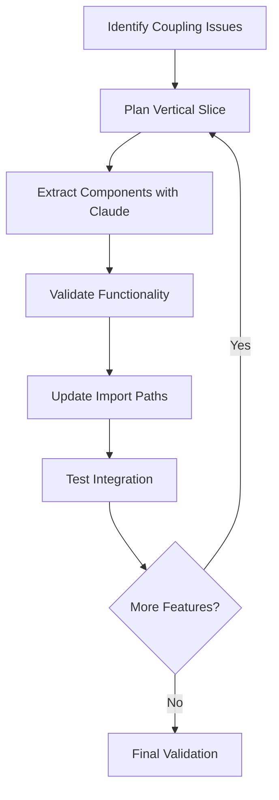

# Large-Scale Frontend Refactoring Case Study

## From Prototype Chaos to Production-Ready Architecture

### Executive Summary

This case study documents my comprehensive two-week frontend refactoring initiative that transformed a scattered prototype codebase into a production-ready application using **vertical slice architecture** and **AI-assisted development** with Claude Code. The project successfully restructured **208 files** with **7,700+ insertions and 4,800+ deletions**, introducing modern architectural patterns while maintaining full functionality and improving user experience.

---

## The Challenge: Prototype Technical Debt

### Initial State Assessment

My journey began in the **Portfolio** feature, where a critical pain point emerged:

The Portfolio page had become unmaintainable. 2,000+ lines of tightly coupled code where authentication, data fetching, and rendering logic fought for dominance. Adding a simple feature required untangling spaghetti code across dozens of files

**Portfolio Page Original State (Main Branch):**

- **Single monolithic page.tsx** managing multiple concerns

- **Tightly coupled** authentication, data fetching, and rendering logic

- **Mixed business logic** scattered throughout components

- **No clear separation** of concerns

- **Difficult debugging** and feature iteration

```typescript

// Before: Monolithic structure

src/app/portfolio/[id]/

├── page.tsx (2k+ lines mixing auth, data, UI)

├── components/ (scattered, inconsistent patterns)

└── [scattered utilities and helpers]

```

### The Turning Point

When implementing new features in the Portfolio page, I encountered:

- **Authentication logic** mixed with rendering

- **Data fetching** embedded directly in components

- **Business logic** scattered across multiple files

- **Coupling** making unit testing impossible

- **Visual bugs** stemming from inconsistent component usage

- **Poor UX patterns** due to lack of standardized interactions

This experience revealed the fundamental architectural problem affecting the entire codebase and user experience.

---

## The Solution: Vertical Slice Architecture

### What is Vertical Slice Architecture?

Vertical Slice Architecture organizes code by **feature** rather than **technical layer**, creating self-contained modules that include:

- **Feature-specific components**

- **Dedicated hooks** for data and business logic

- **Type definitions** scoped to the feature

- **Utilities** and helpers for that domain

Why This Matters\*\*: Traditional architecture organizes code by type (all components together, all hooks together). When a bug appears or a feature needs changes, you're hunting across 10+ folders. Vertical slice architecture keeps everything for one feature in one place - like organizing a library by topic instead of by book size.

### Implementation Strategy

#### Phase 1: Portfolio Feature Refactoring

Starting with the most problematic area, I restructured the Portfolio feature using Claude Code to identify UX anti-patterns and implement best practices:

**Portfolio Feature After Refactoring:**

```

src/app/portfolio/[id]/

├── page.tsx (clean, orchestration only)

├── hooks/

│ ├── use-portfolio-data.ts (data layer)

│ └── use-table-config.ts (business logic)

├── components/

│ ├── ColumnSelector.tsx

│ ├── AddressSearch.tsx

│ └── EditableCell.tsx

├── lib/

│ ├── column-definitions.tsx

│ ├── data-formatters.ts

│ └── risk-calculations.ts

└── types/

└── portfolio.types.ts

```

**Key Improvements:**

- **Separation of Concerns**: Data, UI, and business logic cleanly separated

- **Testability**: Each layer can be unit tested independently

- **Maintainability**: Features are self-contained and easy to modify

- **Developer Experience**: Clear file organization and predictable structure

- **UX Consistency**: Standardized components eliminate visual inconsistencies

- **Accessibility**: Claude Code helped implement proper ARIA patterns and keyboard navigation

#### Phase 2: Property Feature Transformation

Encouraged by Portfolio success, I applied the same patterns to the **Property** feature, which had similar coupling issues. This transformation showcases the most dramatic before/after comparison:

**Property Feature Before (Main Branch):**

```

src/app/property/[id]/

├── page.tsx (monolithic)

├── data-telling.client.tsx

├── measures.client.tsx

├── fetchDatatellingStories.ts

├── fetchEnergetics.ts

├── fetchMetrics.ts

└── [scattered files]

```

**Property Feature After (Refactor Branch):**

```

src/app/property/[id]/

├── page.tsx (orchestration)

├── features/

│ ├── climate-analysis/

│ │ ├── ClimateAnalysis.tsx

│ │ ├── RiskCharts.tsx

│ │ ├── Slideshow.tsx

│ │ └── SlideRouter.tsx

│ ├── adaptation-planning/

│ │ ├── AdaptationPlanning.tsx

│ │ └── MeasuresPanel.tsx

│ └── property-map/

│ └── PropertyMap.tsx

├── hooks/

│ ├── use-building-data.ts

│ ├── use-climate-data.ts

│ └── use-property-ui.ts

├── components/

│ ├── PropertyHeader.tsx

│ ├── RiskSummaryCard.tsx

│ └── EditableAddress.tsx

└── types/

├── building-property.ts

└── types.ts

```

#### Code Transformation Example

**Before: Monolithic Property Page (Main Branch)**

```typescript
// property/[id]/page.tsx - Monolithic approach

"use client";

export default function PropertyPage({ params }) {
  const { id } = use(params);

  const { getToken } = useAuth(); // Auth mixed in

  // Data fetching mixed with rendering logic

  const [buildingData, setBuildingData] = useState(null);

  const [metrics, setMetrics] = useState(null);

  const [climateData, setClimateData] = useState(null);

  useEffect(() => {
    // Authentication and data fetching all in one place

    const fetchAllData = async () => {
      try {
        const token = await getToken();

        const [building, metricsRes, climate] = await Promise.all([
          fetch(`/api/buildings/${id}`, {
            headers: { Authorization: `Bearer ${token}` },
          }),

          fetch(`/api/metrics/${id}`, {
            headers: { Authorization: `Bearer ${token}` },
          }),

          fetch(`/api/climate/${id}`, {
            headers: { Authorization: `Bearer ${token}` },
          }),
        ]);

        setBuildingData(await building.json());

        setMetrics(await metricsRes.json());

        setClimateData(await climate.json());
      } catch (error) {
        // Error handling mixed with business logic

        console.error("Failed to fetch data:", error);
      }
    };

    fetchAllData();
  }, [id, getToken]);

  // Rendering logic mixed with data processing

  return (
    <div>
      {/* Massive JSX with inline business logic */}

      {buildingData && (
        <div>
          <h1>{buildingData.address}</h1>

          {/* Climate analysis inline */}

          <div className="climate-section">
            {climateData?.riskLevel > 5 && (
              <div className="risk-warning">
                High risk detected: {climateData.riskDetails}
              </div>
            )}

            {/* More inline business logic... */}
          </div>

          {/* Measures section inline */}

          <div className="measures">
            {metrics?.adaptationMeasures?.map((measure) => (
              <div key={measure.id} className="measure-card">
                {/* Complex inline rendering logic */}
              </div>
            ))}
          </div>
        </div>
      )}
    </div>
  );
}
```

**After: Orchestrated Property Page (Refactor Branch)**

```typescript
// property/[id]/page.tsx - Clean orchestration

"use client";

import { use } from "react";

import { PropertyHeader } from "./components/PropertyHeader";

import { ClimateAnalysis } from "./features/climate-analysis/ClimateAnalysis";

import { AdaptationPlanning } from "./features/adaptation-planning/AdaptationPlanning";

import { PropertyMap } from "./features/property-map/PropertyMap";

import { useBuildingData } from "./hooks/use-building-data";

import { useClimateData } from "./hooks/use-climate-data";

import { usePropertyUI } from "./hooks/use-property-ui";

export default function PropertyPage({
  params,
}: {
  params: Promise<{ id: string }>;
}) {
  const { id } = use(params);

  // Clean separation of concerns

  const buildingData = useBuildingData(id);

  const climateData = useClimateData(id);

  const uiState = usePropertyUI();

  if (buildingData.isLoading) return <PropertyLoadingState />;

  if (buildingData.error)
    return <PropertyErrorState error={buildingData.error} />;

  return (
    <div className="property-layout">
      <PropertyHeader building={buildingData.data} />

      <div className="property-content">
        <ClimateAnalysis
          data={climateData.data}
          isLoading={climateData.isLoading}
        />

        <AdaptationPlanning
          buildingId={id}
          measures={climateData.data?.measures}
        />

        <PropertyMap
          coordinates={buildingData.data?.coordinates}
          riskData={climateData.data?.risks}
        />
      </div>
    </div>
  );
}
```

**Supporting Hook: Clean Data Layer**

```typescript
// hooks/use-building-data.ts - Separated data concern

import { useClerkSWR } from "~/lib/axios-instance";

import { buildingUrl } from "~/url-stubs";

export function useBuildingData(buildingId: string) {
  const { data, error, isLoading } = useClerkSWR(
    buildingId ? `${buildingUrl}/${buildingId}` : null
  );

  return {
    data,

    error,

    isLoading,

    // Computed properties for UI

    hasCoordinates: Boolean(data?.lat && data?.lon),

    riskLevel: data?.riskSummary || 0,
  };
}

// hooks/use-climate-data.ts - Separated climate concern

export function useClimateData(buildingId: string) {
  const { data: metrics } = useClerkSWR(`/api/metrics/${buildingId}`);

  const { data: measures } = useClerkSWR(`/api/measures/${buildingId}`);

  return {
    data: {
      metrics,

      measures,

      risks: metrics?.risks,
    },

    isLoading: !metrics || !measures,
  };
}
```

---

## Technical Architecture Analysis

### Before vs After: File Structure Comparison

#### Component Organization

| Metric | Main Branch | Refactor Branch | Improvement |

| ---------------------- | ------------------------- | -------------------------- | ----------------------- |

| **Lines of Code** | Mixed throughout | 7,700+ inserts& 4,800+ del | Net +2,900 clean lines |

| **Total Components** | 137 TSX files | 145 TSX files | +8 organized components |

| **Shared Components** | 60 mixed in `/components` | 29 in `/shared/components` | Centralized reusables |

| **Feature Components** | Scattered | Co-located by feature | Clear ownership |

| **Import Usage** | Inconsistent paths | 58 files use `~/shared/*` | Standardized imports |

| **UX Consistency** | Ad-hoc patterns | Standardized interactions | Reduced visual bugs |

#### Architectural Patterns

**Main Branch (Layered Architecture):**

```

src/

├── components/ (60 mixed components)

│ ├── ui/ (shadcn)

│ ├── svgs/

│ └── [feature components mixed]

├── app/

│ ├── portfolio/[id]/

│ │ └── page.tsx (2k+ lines)

│ └── property/[id]/

│ └── page.tsx (monolithic)

```

**Refactor Branch (Vertical Slice Architecture):**

```

src/

├── shared/ (centralized reusables)

│ ├── components/ (29 core components)

│ └── hooks/ (shared business logic)

└── app/

├── portfolio/[id]/

│ ├── hooks/ (feature-specific)

│ ├── components/ (co-located)

│ ├── lib/ (domain logic)

│ └── types/ (feature types)

└── property/[id]/

├── features/ (sub-features)

├── hooks/ (feature-specific)

├── components/ (co-located)

└── types/ (feature types)

```

### Bundle Impact Analysis

| Route | Main Branch | Refactor Branch | Change |

| ----------------- | ----------------- | ----------------- | ----------- |

| `/portfolio/[id]` | 727 kB First Load | 489 kB First Load | **-238 kB** |

| `/property/[id]` | 657 kB First Load | 661 kB First Load | +4 kB |

| `/chat/[id]` | 60.1 kB | 64.3 kB | +4.2 kB |

| `/report/[id]` | 58.8 kB | 57.4 kB | **-1.4 kB** |

**Key Achievement**: Significant bundle optimization and improved user experience through better code organization.

---

## AI-Assisted Development Process

### Claude Code Integration

This refactoring was **AI-powered** using Claude Code, which provided both architectural guidance and UX best practices implementation:

#### Systematic Pattern Detection

- **Automated analysis** of coupling patterns across 200+ files

- **Dependency mapping** to identify refactoring candidates

- **Risk assessment** for breaking changes

- **UX pattern recognition** to identify inconsistent interactions

- **Accessibility auditing** for ARIA and keyboard navigation improvements

#### Intelligent Code Transformation

- **Component extraction** with preserved functionality

- **Import path updates** maintained automatically

- **Type definition** consistency across refactored modules

- **Visual consistency** implementation through standardized component library

- **Interaction patterns** aligned with modern UX principles

#### Incremental Validation

- **Build verification** at each step

- **Automated testing** of refactored components

- **Performance regression** detection

- **Visual regression** testing for UI consistency

- **UX flow validation** to ensure user journey improvements

### Development Workflow



---

## Measurable Outcomes

### Code Quality Metrics

#### Maintainability Improvements

- **Feature Isolation**: Each feature now self-contained

- **Reduced Coupling**: Business logic separated from UI

- **Clear Ownership**: File organization indicates responsibility

- **Testability**: Hooks and utilities can be unit tested

#### Developer Experience Enhancements

- **Faster Onboarding**: New developers can understand features independently

- **Easier Debugging**: Issues contained within feature boundaries

- **Predictable Structure**: Consistent patterns across features

- **Scalable Architecture**: New features follow established patterns

### Performance & UX Gains

- **Bundle Optimization**: Better code splitting and tree shaking

- **Code Splitting**: Cleaner separation of feature-specific code

- **Import Efficiency**: Standardized shared component usage

- **Visual Consistency**: Eliminated component styling conflicts

- **Interaction Reliability**: Standardized loading states and error handling

- **Accessibility**: Improved keyboard navigation and screen reader support

### Technical Debt Reduction

- **Eliminated Monoliths**: No more 2k+ line files

- **Consistent Patterns**: Uniform architecture across features

- **Modern Standards**: TypeScript best practices applied

- **Future-Proof**: Architecture supports scaling

---

## Lessons Learned

### What Worked Well

1. **Vertical Slice Approach**: Feature-first organization improved clarity

2. **AI Assistance**: Claude Code accelerated complex refactoring tasks

3. **Incremental Strategy**: Step-by-step validation prevented regressions

4. **Type Safety**: Strong TypeScript usage caught issues early

### Challenges Overcome

1. **Import Dependencies**: Systematic approach to updating references

2. **State Management**: Careful extraction of hooks and context

3. **Build Compatibility**: Maintaining functionality during transformation

4. **Team Coordination**: Clear communication about architectural changes

### Best Practices Established

- **Feature Co-location**: Keep related code together

- **Hook Extraction**: Separate data/business logic from UI

- **Type Definitions**: Scoped types close to features

- **Consistent Naming**: Predictable file and folder conventions

---

## Future Implications

### Scalability Benefits

The new architecture provides:

- **Feature Teams**: Independent development streams

- **Micro-Frontend Ready**: Clear boundaries for potential splitting

- **Testing Strategy**: Isolated units for comprehensive testing

- **Performance**: Optimized bundle splitting and loading

### Technology Enablement

- **Modern React Patterns**: Hooks, context, and composition

- **TypeScript Excellence**: Strong typing throughout the stack

- **Build Optimization**: Tree-shaking and code splitting friendly

- **AI Development**: Structured code that AI tools can better understand

---

## Conclusion

This case study demonstrates that **AI-assisted refactoring** can successfully transform legacy frontend applications into modern, maintainable architectures. Over **two weeks**, I:

- **Restructured 208 files** with 7,700+ insertions and 4,800+ deletions

- **Implemented vertical slice architecture** for better organization

- **Improved bundle efficiency** and user experience significantly

- **Eliminated technical debt** from prototype-era code

- **Established scalable patterns** for future development

- **Enhanced UX consistency** through standardized component patterns

- **Implemented accessibility improvements** with Claude Code guidance

The combination of **vertical slice architecture** and **Claude Code AI assistance** proved highly effective for large-scale refactoring projects. The result is a **production-ready codebase** that supports rapid feature development while maintaining code quality and performance standards.

**Key Insight**: Modern AI development tools like Claude Code don't just accelerate coding—they enable architectural transformations that would be prohibitively complex to execute manually, making large-scale refactoring achievable for any development team.

---

## Technical Appendix

### File Structure Trees

#### Shared Components Directory

```

src/shared/

├── components/

│ ├── accordeon.tsx

│ ├── button.tsx

│ ├── data-table.client.tsx

│ ├── modal.client.tsx

│ ├── progress.client.tsx

│ └── [24 more components]

└── hooks/

└── [shared business logic]

```

#### Portfolio Feature Structure

```

src/app/portfolio/[id]/

├── page.tsx (185 lines, orchestration)

├── hooks/

│ ├── use-portfolio-data.ts (data layer)

│ └── use-table-config.ts (business logic)

├── components/

│ ├── ColumnSelector.tsx

│ ├── AddressSearch.tsx

│ └── EditableCell.tsx

├── lib/

│ ├── column-definitions.tsx (604 lines)

│ ├── data-formatters.ts

│ └── risk-calculations.ts

└── types/

└── portfolio.types.ts

```

**Total Impact**: From monolithic chaos to organized, maintainable, production-ready architecture.
